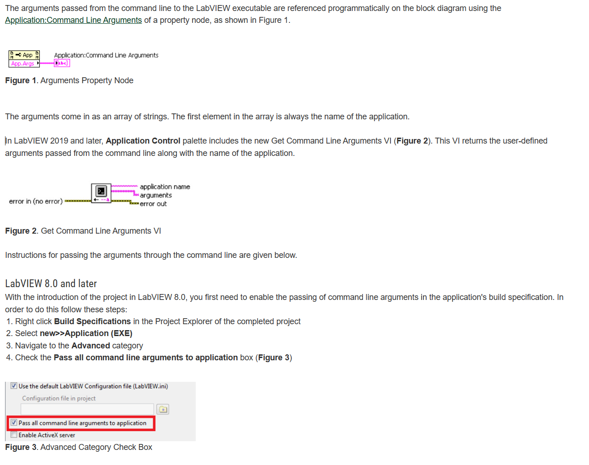
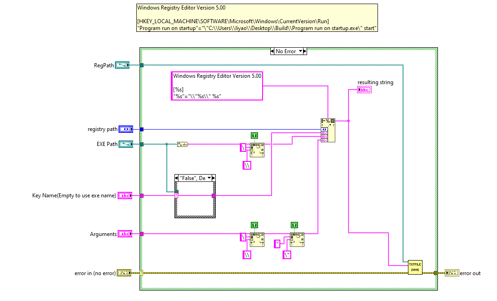
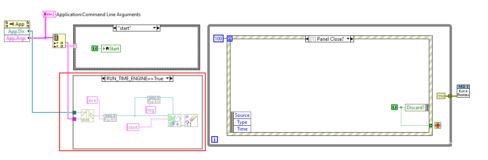

# LabVIEW-Program-run-on-startup
LabVIEW范例：如何让程序在系统启动时自启动

> [!NOTE]
> Example 依赖 [NEVSTOP-Programming-Palette](https://github.com/NEVSTOP-LAB/NEVSTOP-Programming-Palette).


## 需要了解

1. [MSDN:Run and RunOnce Registry Keys](https://learn.microsoft.com/en-us/windows/win32/setupapi/run-and-runonce-registry-keys?redirectedfrom=MSDN)

```text
Use Run or RunOnce registry keys to make a program run when a user logs on.
The Run key makes the program run every time the user logs on,
while the RunOnce key makes the program run one time, and then the key is deleted.
These keys can be set for the user or the machine.

The data value for a key is a command line no longer than 260 characters.
Register programs to run by adding entries of the form description-string=commandline.
You can write multiple entries under a key.
If more than one program is registered under any particular key,
the order in which those programs run is indeterminate.

The Windows registry includes the following four Run and RunOnce keys:

HKEY_LOCAL_MACHINE\Software\Microsoft\Windows\CurrentVersion\Run
HKEY_LOCAL_MACHINE\Software\Microsoft\Windows\CurrentVersion\RunOnce
HKEY_CURRENT_USER\Software\Microsoft\Windows\CurrentVersion\Run
HKEY_CURRENT_USER\Software\Microsoft\Windows\CurrentVersion\RunOnce

```

2. [Pass Command Line Arguments to a LabVIEW Executable](https://knowledge.ni.com/KnowledgeArticleDetails?id=kA03q000000YHdICAW&l=en-US)




## How-To

1. 创建复用VI，用于创建导入注册表的包含自启动信息的 reg 文件 （此VI已包含在 [NEVSTOP-Programming-Palette](https://github.com/NEVSTOP-LAB/NEVSTOP-Programming-Palette) 5月Rleases 的 application Palette中，直接生成的reg 文件是 UTF-16 LE 编码.




2. 合适的地方调用，范例中，在 EXE 启动后，每次都创建一次，保证 exe 路径发生变化后，注册表信息也能及时更新



3. 按照 [Pass Command Line Arguments to a LabVIEW Executable](https://knowledge.ni.com/KnowledgeArticleDetails?id=kA03q000000YHdICAW&l=en-US) 配置编译 exe

4. 运行 exe后， 双击 reg 文件， 将自启动信息导入注册表，重启系统后，程序会自启动

## KB

1. 如果中文出现乱码如何处理:修改 reg文件的编码方式，设置为 ANSI 或 UTF-16 LE 编码。 
[reg文件导入注册表后出现中文乱码的解决方法](https://blog.csdn.net/xiaojin21cen/article/details/121899054#:~:text=%E9%81%BF%E5%85%8D%E4%B8%AD%E6%96%87%E4%B9%B1%E7%A0%81%E7%9A%84%E6%96%B9%E6%B3%95%E4%B9%9F%E5%BE%88%E7%AE%80%E5%8D%95%EF%BC%8C%E4%BF%AE%E6%94%B9%20reg%E6%96%87%E4%BB%B6%E7%9A%84%E7%BC%96%E7%A0%81%E6%96%B9%E5%BC%8F%EF%BC%8C%E8%AE%BE%E7%BD%AE%E4%B8%BA%20ANSI,%E6%88%96%20UTF-16%20LE%20%E7%BC%96%E7%A0%81%E3%80%82)
